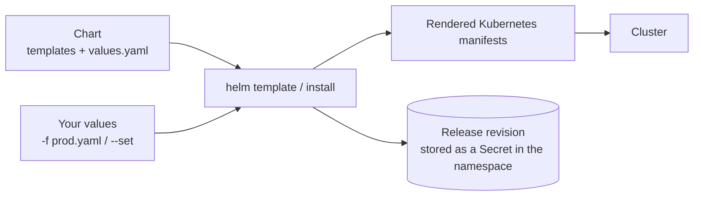
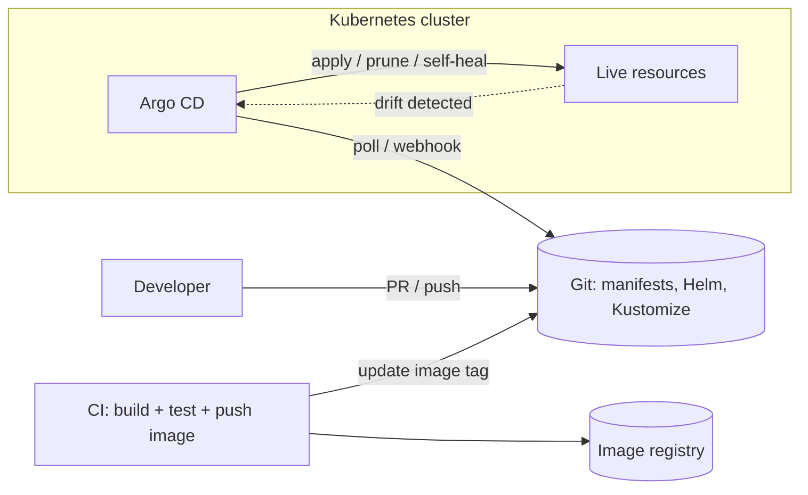
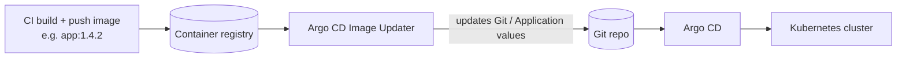

# Helm and Argo CD Concepts — Reading Guide

How to **package** Kubernetes applications (Helm) and **deliver** them continuously from Git (Argo CD).

---

# Part 1: Helm

## 1. What Helm Is

Helm is the package manager for Kubernetes. Instead of maintaining many near-identical YAML files for dev, QA and prod, you write **templates** once and supply different **values** per environment.

- **Chart** — a package: templates plus default values.
- **Release** — one installed instance of a chart in a cluster (you can install the same chart many times under different release names).
- **Repository** — a place that hosts charts (HTTP repo or an OCI registry such as ECR).
- **Revision** — each install/upgrade of a release creates a numbered revision, which is what makes rollback possible.



## 2. Chart Structure

```text
mychart/
  Chart.yaml        # name, version, appVersion, dependencies
  values.yaml       # default configuration
  templates/        # Go-templated manifests
    deployment.yaml
    service.yaml
    ingress.yaml
    _helpers.tpl    # reusable named templates
    NOTES.txt       # message printed after install
  charts/           # downloaded sub-chart dependencies
```

`version` is the chart's own version; `appVersion` is the version of the application it deploys.

## 3. Templating Basics

```yaml
# templates/deployment.yaml
apiVersion: apps/v1
kind: Deployment
metadata:
  name: {{ .Release.Name }}-app
spec:
  replicas: {{ .Values.replicaCount }}
  template:
    spec:
      containers:
        - name: app
          image: "{{ .Values.image.repository }}:{{ .Values.image.tag }}"
          {{- with .Values.resources }}
          resources:
            {{- toYaml . | nindent 12 }}
          {{- end }}
```

- `.Values` — values from `values.yaml` and overrides; `.Release` — release name/namespace; `.Chart` — Chart.yaml data.
- Control flow: `if`, `with`, `range`; helpers: `default`, `quote`, `toYaml`, `include`, `required`.
- **Value precedence** (lowest to highest): chart `values.yaml` → parent chart → `-f file` (later files win) → `--set`.

## 4. Everyday Commands

```bash
helm repo add bitnami https://charts.bitnami.com/bitnami
helm search repo nginx
helm install web ./mychart -n demo --create-namespace -f prod.yaml
helm upgrade --install web ./mychart -n demo -f prod.yaml   # idempotent: install or upgrade
helm list -n demo
helm history web -n demo
helm rollback web 2 -n demo          # back to revision 2
helm uninstall web -n demo
helm template web ./mychart -f prod.yaml   # render locally, no cluster needed
helm lint ./mychart
helm diff upgrade web ./mychart            # plugin: preview changes
```

Add `--atomic --wait --timeout 5m` to an upgrade so Helm waits for readiness and **automatically rolls back** if it fails.

## 5. Hooks, Dependencies and Tests

- **Hooks** — Jobs or Pods run at points in the lifecycle (`pre-install`, `pre-upgrade`, `post-install`, `pre-delete`), for example a database migration before an upgrade.
- **Dependencies** — declare sub-charts in `Chart.yaml` (for example PostgreSQL) and run `helm dependency update`.
- **Tests** — `helm test <release>` runs Pods annotated as tests.

## 6. Helm vs Kustomize

- **Helm** — templating, packaging, versioned releases and rollbacks; best for distributing reusable apps and third-party software.
- **Kustomize** — template-free overlays and patches on plain YAML, built into `kubectl`; best for small per-environment tweaks.
- They combine well: Argo CD can render a Helm chart and apply Kustomize patches on top.

## 7. Helm Pitfalls

- Helm stores release state in the cluster (as Secrets); manual `kubectl edit` changes cause **drift** that the next upgrade may overwrite.
- CRDs in a chart's `crds/` folder are installed once but **not upgraded or deleted** by Helm; manage CRD upgrades separately.
- Never put secrets in `values.yaml` in Git; use Sealed Secrets, External Secrets or SOPS.
- Pin chart versions; an unpinned `latest` chart can change behaviour under you.

---

# Part 2: Argo CD

## 8. What Argo CD Is

Argo CD is a **GitOps** continuous-delivery controller for Kubernetes. **Git is the single source of truth** for what should run. Argo CD runs *inside* the cluster, continually compares Git with live state, and reconciles any difference. Deployments become a `git push` or merged pull request, not a `kubectl apply` from a laptop or CI runner.

**Pull-based delivery:** the cluster pulls from Git. CI does not need credentials to the cluster, which is more secure than push-based pipelines.



## 9. Architecture

- **API server** — the UI, CLI and API; handles authentication and RBAC.
- **Repo server** — clones Git and renders manifests (plain YAML, Helm, Kustomize).
- **Application controller** — compares desired (Git) and live (cluster) state, reports sync/health and performs the sync.
- **Redis** — cache. **Dex** (optional) — SSO integration.
- Optional add-ons: **ApplicationSet controller**, **Notifications**, **Image Updater**.

## 10. Key Resources

- **Application** — "deploy *this path/chart* from *this repo and revision* into *this cluster and namespace*."
- **AppProject** — groups Applications and restricts which repos, clusters, namespaces and resource kinds they may use (multi-team security boundary).
- **ApplicationSet** — generates many Applications from a template (one per cluster, per directory, per environment, per pull request).

```yaml
apiVersion: argoproj.io/v1alpha1
kind: Application
metadata:
  name: demo-app
  namespace: argocd
spec:
  project: default
  source:
    repoURL: https://github.com/<org>/<repo>.git
    targetRevision: main
    path: charts/demo
    helm:
      valueFiles: [values-prod.yaml]
  destination:
    server: https://kubernetes.default.svc
    namespace: demo
  syncPolicy:
    automated:
      prune: true        # delete resources removed from Git
      selfHeal: true     # revert manual changes in the cluster
    syncOptions:
      - CreateNamespace=true
```

## 11. Sync Status and Health

- **Sync status** — `Synced` (live matches Git) or `OutOfSync` (differs).
- **Health status** — `Healthy`, `Progressing`, `Degraded`, `Suspended`, `Missing`.
- **Automated sync** applies changes on its own; **manual sync** waits for a click or CLI command (common for production).
- **Prune** deletes live resources no longer in Git. **Self-heal** reverts out-of-band edits.
- **Sync waves and hooks** — order resources with `argocd.argoproj.io/sync-wave: "1"` annotations and run PreSync/PostSync Jobs (for example migrations).
- **Rollback** — in Git, revert the commit (preferred); the UI can also redeploy an earlier revision when auto-sync is off.

## 12. Image Promotion Flow

1. CI builds and pushes `app:1.4.2` to the registry.
2. Either CI commits the new tag to the Git repo, or **Argo CD Image Updater** watches the registry and writes it back.
3. Argo CD sees the Git change and rolls out the new image.
4. Rollback = revert the commit.

## 12.1 Argo CD Image Updater

**Argo CD Image Updater** is a controller that automatically updates the image tag in your Git repo or the Argo CD Application configuration when a new image is pushed to a registry. It turns image promotion into a GitOps flow without requiring a human to open a PR manually.

It is useful when:

- a CI pipeline builds a new image tag and pushes it to ECR / Docker Hub / GHCR
- you want to automatically promote `latest`, a semver tag, or a digest-based release
- you want image updates to be tracked in Git and reconciled by Argo CD

Typical flow:



Key concepts:

- **Image update strategy** — how it decides when to update: `latest`, semver, digest, or a custom rule.
- **Write-back** — the updater can write the new tag back to a Git repo or patch the Application manifest.
- **Policy** — rules control when an image is considered eligible, such as only update if the tag is newer, not a prerelease, or only update a specific repository.
- **IAM / auth** — in AWS EKS, it often runs with an IRSA role to access ECR and write to Git or the cluster.

In this project, the image updater works as part of the GitOps loop: it monitors the registry and informs Argo CD when a newer image is available, while Git remains the source of truth.

## 13. Typical Repository Patterns

- **App-of-apps** — one root Application whose manifests are themselves Applications, bootstrapping a whole cluster from one object.
- **ApplicationSet** — scalable alternative that templates Applications from generators.
- **Separate config repo** — keep deployment manifests apart from application source code, so config changes do not trigger builds and access can be controlled separately.
- **Environment promotion** — folders or branches for dev / staging / prod, promoted by pull request.

## 14. Secrets in GitOps

Plain Kubernetes Secrets must not be committed to Git. Options:

- **Sealed Secrets** — encrypt with a cluster public key; only the cluster can decrypt; the encrypted form is safe in Git.
- **SOPS** (with KMS/age) — encrypt values in files; decrypt at render time.
- **External Secrets Operator** or the **Secrets Store CSI Driver** — store secrets in AWS Secrets Manager or Vault and sync/mount them into the cluster; Git holds only a reference.

---

# Part 3: Interview Questions and Answers

**Q1. What is the difference between a Helm chart and a release?**
A chart is the reusable package; a release is one installed instance of it in a cluster with its own name, values and revision history.

**Q2. How do you roll back with Helm?**
`helm history <release>` to find the revision, then `helm rollback <release> <revision>`. Use `--atomic` on upgrades to roll back automatically on failure.

**Q3. In what order are Helm values merged?**
Chart defaults, then parent chart values, then `-f` files in order, then `--set`, with later sources winning.

**Q4. What is GitOps and why use it?**
Git holds the desired state and an agent in the cluster reconciles to it. Benefits: audit trail through commits, easy rollback via revert, consistent environments, no cluster credentials in CI, and automatic drift correction.

**Q5. What do `prune` and `selfHeal` do?**
`prune` removes cluster resources that were deleted from Git. `selfHeal` reverts manual changes made directly in the cluster.

**Q6. Argo CD shows OutOfSync but the diff looks identical. Why?**
Usually fields mutated by controllers or defaulting (replica counts managed by an HPA, injected annotations, CRD defaults). Use `ignoreDifferences` for those fields or `RespectIgnoreDifferences`.

**Q7. How does Argo CD manage multiple clusters?**
Register clusters (`argocd cluster add`) and target them in `destination`; use ApplicationSet cluster generators to roll out one app to many clusters.

**Q8. How do you handle database migrations with Argo CD or Helm?**
Run them as a Helm pre-upgrade hook or an Argo CD PreSync hook Job, and make migrations backward compatible so rollbacks and rolling updates are safe.

**Q9. How do you keep secrets out of Git?**
Sealed Secrets, SOPS, or External Secrets/CSI driver referencing a secret manager. Never commit raw Secret manifests.

**Q10. Helm or Kustomize?**
Helm for packaging and third-party software with versioned releases; Kustomize for simple environment overlays on your own YAML. Argo CD supports both, even together.

**Q11. How do you ensure a bad release does not take everything down?**
Rolling updates with readiness probes, PodDisruptionBudgets, progressive delivery (Argo Rollouts canary/blue-green with metric analysis), manual sync for production, and automatic rollback on failed health.

**Q12. What is Argo CD Image Updater and why do teams use it?**
It watches a container registry for new tags and writes the update back to Git or the Application config, so Argo CD can automatically roll out the newer image. It reduces manual promotion work and keeps the rollout fully GitOps-driven.

**Q13. Why is Argo CD safer than a CI job running `kubectl apply`?**
The CI system needs no cluster credentials (pull model), the cluster state is continuously verified rather than only at deploy time, and drift is detected and corrected.

---

## Official References

- Helm documentation: https://helm.sh/docs/
- Chart template guide: https://helm.sh/docs/chart_template_guide/
- Helm best practices: https://helm.sh/docs/chart_best_practices/
- Argo CD documentation: https://argo-cd.readthedocs.io/en/stable/
- Argo CD sync options and waves: https://argo-cd.readthedocs.io/en/stable/user-guide/sync-waves/
- ApplicationSet: https://argo-cd.readthedocs.io/en/stable/operator-manual/applicationset/
- Argo CD Image Updater: https://argocd-image-updater.readthedocs.io/
- Argo Rollouts (canary / blue-green): https://argo-rollouts.readthedocs.io/
- OpenGitOps principles: https://opengitops.dev/
