# Kubernetes Concepts — Reading Guide

A plain-language reference for the resources used in this demo. Manifests are in [app/k8s](app/k8s).

---

## 1. Kubernetes Architecture

A cluster has two halves: the **control plane** (the "master", which makes decisions) and the **worker nodes** (which run your workloads). On EKS, AWS manages the control plane for you; you only see the worker nodes.

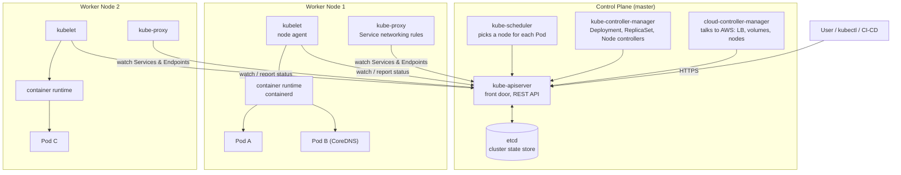

### Control plane components

- **kube-apiserver** — the single entry point. Every component and every `kubectl` command talks to it; nothing talks to etcd directly except the API server.
- **etcd** — a consistent key-value database holding the entire desired and current state of the cluster.
- **kube-scheduler** — watches for new Pods with no node assigned and chooses a suitable node (based on CPU/memory, affinity, taints, etc.).
- **kube-controller-manager** — runs control loops (Deployment, ReplicaSet, Node, Job controllers…) that constantly compare *desired state* with *actual state* and fix the difference.
- **cloud-controller-manager** — connects Kubernetes to the cloud provider; this is what creates AWS load balancers and attaches EBS volumes.

### Worker node components

- **kubelet** — agent on each node. It receives Pod specs from the API server, tells the container runtime to run them, runs health probes and reports status back.
- **container runtime** — actually pulls images and runs containers (containerd, CRI-O).
- **kube-proxy** — programs iptables/IPVS rules on the node so traffic sent to a Service IP is forwarded to one of its healthy Pods.

### Add-ons

- **CoreDNS** — the cluster's DNS server, running as Pods in `kube-system`. It lets Pods find Services by name, e.g. `backend.default.svc.cluster.local`, instead of by changing IP addresses.
- **CNI plugin** (AWS VPC CNI on EKS) — gives every Pod its own IP and connects Pods across nodes.
- **Ingress / Load Balancer Controller** — watches Ingress and Service objects and creates the matching AWS ALB/NLB.

### How a request flows through the control plane

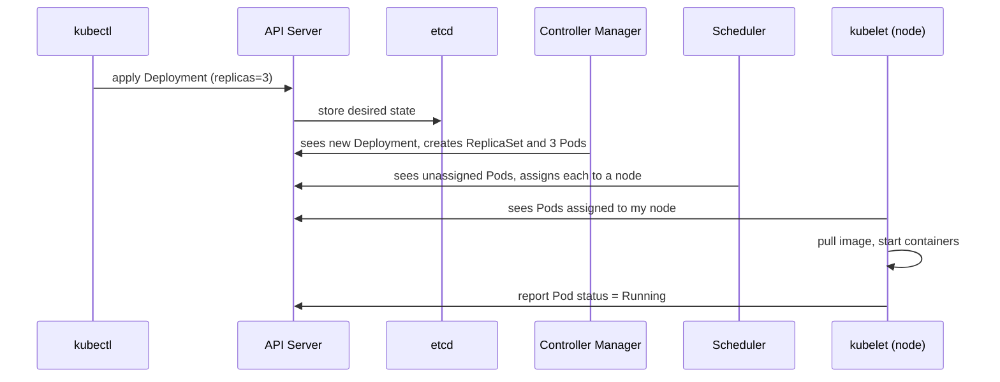

### How a name gets resolved (CoreDNS)

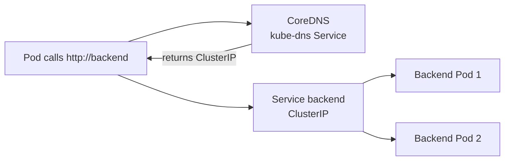

---

## 2. Pod

A Pod is the smallest deployable unit in Kubernetes. It wraps one (sometimes more) containers that share the same network namespace (one IP, shared `localhost`) and optionally the same volumes. Pods are **ephemeral**: when one dies it is not repaired, it is replaced by a new Pod with a new IP. Because of this you almost never create bare Pods; a higher-level controller manages them.

---

## 3. ReplicaSet

A ReplicaSet guarantees that a specified number of identical Pods are running at any time. It uses a label selector to find its Pods, creates new ones if some are missing and deletes extras if there are too many. It provides self-healing and scaling but has no concept of updates — which is why Deployments exist. Demo: [01-replicaset-demo.yaml](app/k8s/01-replicaset-demo.yaml).

---

## 4. Deployment

A Deployment is the standard way to run a stateless application. It manages ReplicaSets on your behalf and adds declarative updates, rollout history, rollback and scaling. When you change the Pod template (for example a new image tag), the Deployment creates a new ReplicaSet and shifts Pods from the old one to the new one. Demo: [02-deployment.yaml](app/k8s/02-deployment.yaml).

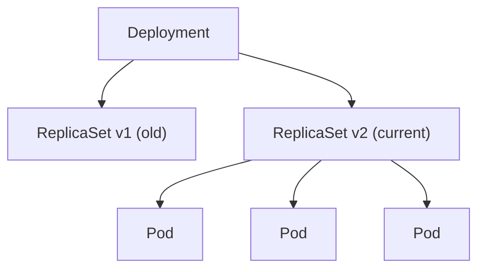

### Deployment strategies

**RollingUpdate (default)** — Pods are replaced gradually: new Pods start while old ones are terminated, so the app stays available throughout. Two knobs control the pace:
- `maxSurge` — how many extra Pods may exist above the desired count during the update.
- `maxUnavailable` — how many Pods may be down during the update.

Best for: web apps and APIs where zero downtime matters and two versions can briefly run side by side.

**Recreate** — all old Pods are killed first, then new Pods are created. This causes downtime but guarantees only one version ever runs.

Best for: apps that cannot run two versions at once (for example incompatible database schema changes or a single-writer lock).

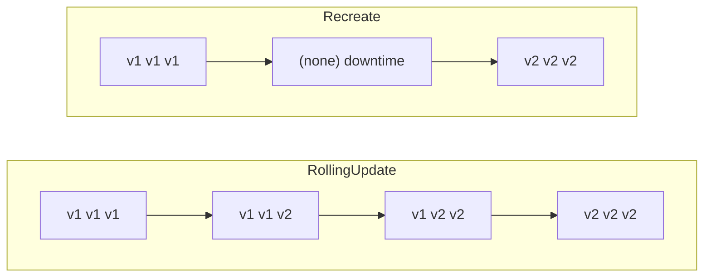

Rollback: `kubectl rollout undo deployment/<name>` switches back to the previous ReplicaSet.

### maxSurge and maxUnavailable explained

Both accept an absolute number or a percentage of `replicas` (percentages round up for surge and down for unavailable). Defaults are 25% each.

- **maxSurge** — how many Pods *above* the desired count may exist during the update. Higher = faster rollout but needs spare capacity.
- **maxUnavailable** — how many Pods *below* the desired count may be unavailable. Higher = faster rollout but less serving capacity.

With `replicas: 4`:

- `maxSurge: 1, maxUnavailable: 0` — never drops below 4 ready Pods; starts 1 new Pod, waits until it is Ready, then removes 1 old one. Safest, needs room for 5 Pods.
- `maxSurge: 0, maxUnavailable: 1` — never exceeds 4 Pods; kills 1 old Pod, then starts 1 new one. Saves resources, capacity dips to 3.
- `maxSurge: 100%, maxUnavailable: 0` — blue/green-like: starts all 4 new Pods first, then removes the old ones. Fastest and safest, but needs double capacity.

They cannot both be 0 (the rollout could not progress). Related fields: `minReadySeconds` (how long a new Pod must stay Ready before it counts as available), `progressDeadlineSeconds` (when a stuck rollout is marked failed) and `revisionHistoryLimit` (how many old ReplicaSets are kept for rollback).

---

## 5. Services

Pod IPs change constantly, so clients cannot rely on them. A Service provides a **stable virtual IP and DNS name** and load-balances traffic across all Pods matching its label selector. kube-proxy implements it on each node.

### ClusterIP (default)

Exposes the Service on an internal IP reachable only from inside the cluster. Used for service-to-service communication, e.g. frontend calling backend. Demo: [03-service-clusterip.yaml](app/k8s/03-service-clusterip.yaml).

### NodePort

Builds on ClusterIP and additionally opens the same static port (range 30000–32767) on **every node**. Traffic to `<NodeIP>:<NodePort>` reaches the Service. Useful for quick tests or as a building block for external load balancers, but not ideal for production because you must expose node IPs.

### LoadBalancer

Builds on NodePort and asks the cloud provider to create an external load balancer (an AWS NLB on EKS) that forwards to the nodes. This gives a single public address per Service. Demo: [04-service-loadbalancer.yaml](app/k8s/04-service-loadbalancer.yaml).

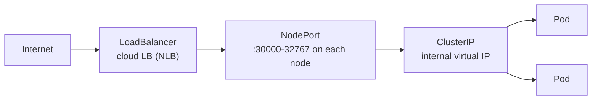

Each type includes the one before it: LoadBalancer ⊃ NodePort ⊃ ClusterIP.

*(Also exists: **ExternalName**, which maps a Service name to an external DNS name, and **Headless** services (`clusterIP: None`) which return Pod IPs directly instead of a virtual IP.)*

---

## 6. Ingress

An Ingress defines Layer 7 (HTTP/HTTPS) routing rules — by host name or URL path — that send external traffic to different Services through **one** shared load balancer. An Ingress object does nothing on its own; an **Ingress controller** (here the AWS Load Balancer Controller) watches it and provisions the actual AWS ALB. This avoids paying for one load balancer per Service and adds TLS termination and path routing. Demo: [05-ingress.yaml](app/k8s/05-ingress.yaml).

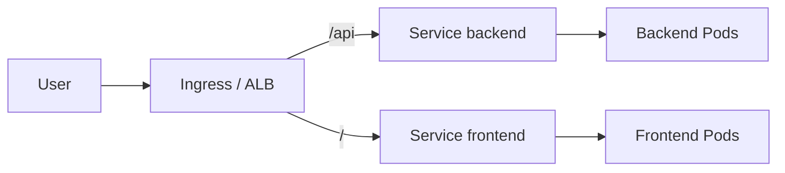

Service LoadBalancer = one LB per Service at Layer 4 (TCP). Ingress = one LB for many Services at Layer 7 (HTTP).

### Why Ingress is chosen over a LoadBalancer Service in the cloud

Every `type: LoadBalancer` Service provisions its own cloud load balancer with its own public IP. With 20 apps that means 20 load balancers, each billed hourly and each needing its own DNS record and TLS certificate. Ingress fixes this:

- **Cost** — one ALB serves many Services instead of one NLB per Service.
- **Host and path routing** — `app.example.com/api` and `app.example.com/web` can go to different Services; a plain LoadBalancer Service cannot look inside HTTP.
- **Central TLS termination** — certificates are managed once at the load balancer (for example with AWS ACM) instead of in every app.
- **One entry point** — a single DNS name and a single place to add redirects, auth or WAF rules.

A LoadBalancer Service is still the right choice for non-HTTP traffic (databases, gRPC over raw TCP, MQTT, game servers) or when you need a fixed Layer 4 endpoint.

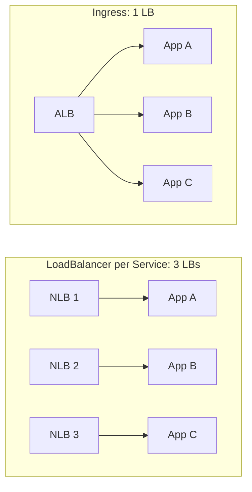

### Limits of Ingress and the Gateway API

Ingress has real weaknesses:

- It only understands **HTTP/HTTPS**. TCP, UDP and gRPC-style routing are not part of the spec.
- The spec is minimal (host + path). Anything more — header matching, traffic splitting, retries, timeouts, rewrites — is done through **controller-specific annotations**, which are not portable between NGINX, ALB, Traefik and others.
- One object mixes infrastructure concerns (the load balancer, TLS) with application routing, so platform teams and app teams edit the same resource.

The **Gateway API** is the successor designed to fix this. It splits responsibilities into separate resources:

- **GatewayClass** — which controller/implementation is used (like a StorageClass for load balancers). Owned by the infrastructure provider.
- **Gateway** — the actual listener: ports, protocols, TLS. Owned by the platform/cluster team.
- **HTTPRoute / GRPCRoute / TCPRoute / TLSRoute / UDPRoute** — the routing rules. Owned by application teams, and attached to a Gateway.

Benefits: multi-protocol support, built-in header matching, weighted traffic splitting (canary) and redirects without annotations, role-based ownership, and cross-namespace routing with explicit permission. Ingress is feature-frozen, and Gateway API is the direction the ecosystem is moving.

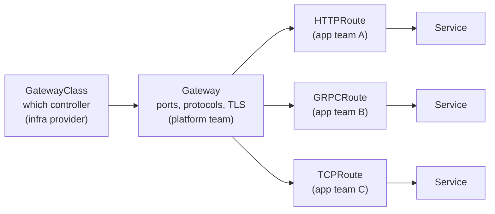

---

## 7. Pod Scheduling: Node Selector, Affinity, Taints and Tolerations

The kube-scheduler decides which node runs each Pod. These features let you influence that decision. The key difference: **selectors and affinity attract Pods to nodes (Pod-side preference); taints repel Pods from nodes (node-side restriction).**

### Node Selector

The simplest form: a Pod lists labels (`nodeSelector: {disktype: ssd}`) and is only scheduled onto nodes carrying **all** those labels. It is a hard requirement with exact-match only.

### Node Affinity

A more expressive version of nodeSelector. It supports operators (`In`, `NotIn`, `Exists`, `Gt`, `Lt`) and two strengths:

- `requiredDuringSchedulingIgnoredDuringExecution` — **hard** rule; the Pod stays Pending if no node matches.
- `preferredDuringSchedulingIgnoredDuringExecution` — **soft** rule with a weight; the scheduler tries but may fall back.

Example use: run on nodes in specific availability zones, or prefer GPU nodes.

### Pod Affinity and Pod Anti-Affinity

These schedule a Pod relative to **other Pods** rather than node labels, within a topology domain (node, zone).

- **Pod affinity** — place this Pod near Pods with certain labels (for example a web app on the same node as its cache for low latency).
- **Pod anti-affinity** — keep this Pod away from Pods with certain labels (for example spread replicas across nodes or zones so one failure does not take them all down).

### Taints and Tolerations

A **taint** is set on a **node** and tells the scheduler "do not place Pods here unless they tolerate this". A **toleration** is set on a **Pod** and allows (but does not force) it onto a node with a matching taint. Taint effects:

- `NoSchedule` — new Pods without a toleration are not scheduled here.
- `PreferNoSchedule` — the scheduler avoids the node if it can (soft).
- `NoExecute` — also evicts already-running Pods that lack a toleration.

Example use: reserve GPU or high-memory nodes for specific workloads; the control plane nodes are tainted so normal Pods do not run there. Kubernetes itself adds taints such as `node.kubernetes.io/not-ready` when a node is unhealthy.

A toleration only **permits**; it does not attract. To dedicate a node to a workload you combine both: **taint the node** (keep others out) and **node affinity/selector on the Pod** (pull it in).

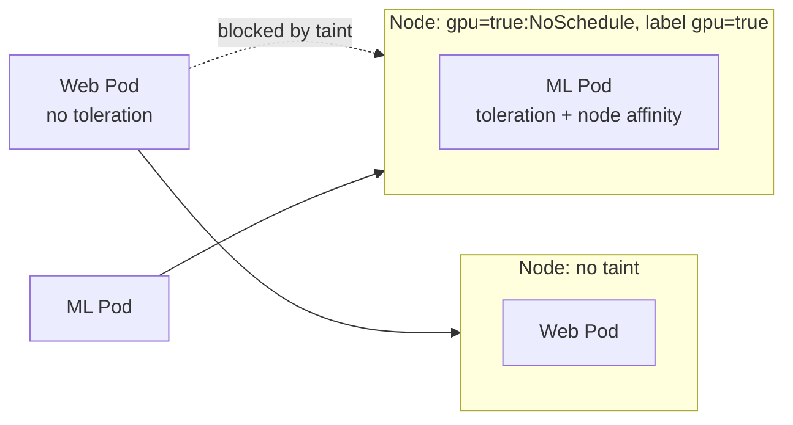

---

## 8. Quality of Service (QoS) Classes

When a node runs out of memory or CPU, the kubelet must decide which Pods to evict or kill first. Kubernetes assigns every Pod a QoS class automatically, based on the **requests** (guaranteed amount, used for scheduling) and **limits** (maximum allowed) of its containers.

- **Guaranteed** — every container has CPU and memory requests **equal to** limits. Highest priority, last to be evicted. Use for critical workloads.
- **Burstable** — at least one container has a request or limit, but the Pod does not meet the Guaranteed criteria (for example requests lower than limits). Middle priority; can use spare capacity but may be evicted under pressure.
- **BestEffort** — no requests or limits at all. Lowest priority, evicted first, and scheduling gives no resource guarantee.

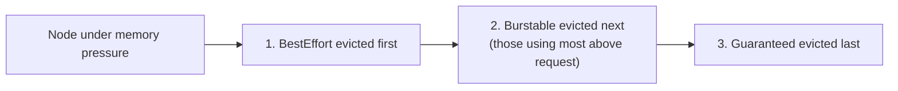

Practical tip: always set requests and limits. Exceeding a **memory** limit gets the container OOM-killed; exceeding a **CPU** limit only throttles it.

---

## 9. Other Workload Controllers

Deployments suit stateless apps. Other controllers cover different patterns.

### DaemonSet

Ensures **exactly one Pod runs on every node** (or on every node matching a selector). When a node joins the cluster the Pod is added automatically; when a node leaves, the Pod is removed. Typical uses: log collectors (Fluent Bit), monitoring agents (node-exporter), and networking components — `kube-proxy` and the AWS VPC CNI are themselves DaemonSets. To run on tainted nodes, a DaemonSet needs matching tolerations. It supports `RollingUpdate` with `maxUnavailable` (nodes updated at a time).

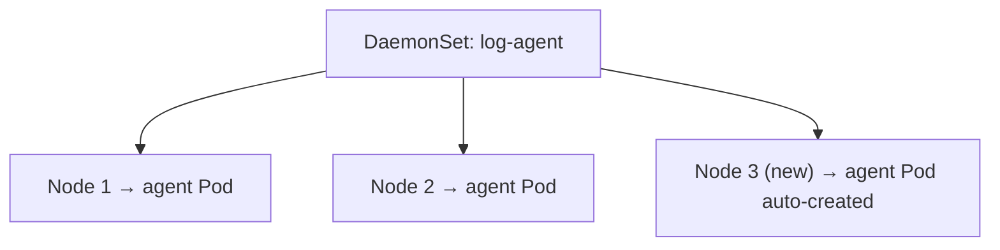

### StatefulSet

Like a Deployment but for **stateful apps** (databases, Kafka, Elasticsearch). Pods get stable, ordered names (`db-0`, `db-1`, `db-2`), stable DNS through a headless Service, are created/terminated in order, and each gets its own persistent volume that follows it across restarts. A Deployment's Pods are interchangeable; a StatefulSet's Pods are not.

### Job and CronJob

A **Job** runs Pods **to completion** (batch work, migrations) and retries on failure, instead of keeping them running forever. A **CronJob** creates Jobs on a cron schedule (for example a nightly backup).

---

## 10. Availability, Scaling and Health

### PodDisruptionBudget (PDB)

A PDB limits how many Pods of an application may be down at once during **voluntary disruptions** — node drains, cluster upgrades, node-group scaling, autoscaler scale-down. You set either `minAvailable` or `maxUnavailable`, plus a label selector. If an eviction would violate the budget, it is blocked until it is safe. It does **not** protect against involuntary failures such as a node crash or OOM kill.

Example: with 4 replicas and `minAvailable: 3`, `kubectl drain` can evict only one Pod at a time and waits for its replacement to become Ready before evicting the next.

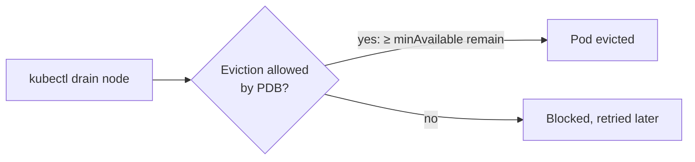

PDB vs `maxUnavailable` in a Deployment: the strategy setting governs **rollouts**; a PDB governs **evictions** by other actors. Use both for real high availability, and avoid `minAvailable` equal to `replicas` because it makes nodes impossible to drain.

### Probes (health checks)

The kubelet runs three kinds of checks on containers:

- **Liveness** — is the container healthy? On failure it is **restarted**.
- **Readiness** — can it serve traffic? On failure the Pod is **removed from Service endpoints** (not restarted). Rolling updates rely on this to know when a new Pod counts as available.
- **Startup** — has a slow-starting app finished booting? Disables the other probes until it succeeds.

### Horizontal Pod Autoscaler (HPA)

Automatically changes a Deployment's `replicas` based on metrics such as CPU or memory utilisation (measured relative to the Pod's **requests**) or custom metrics, within `minReplicas` and `maxReplicas`. It scales **Pods**; the Cluster Autoscaler or Karpenter scales **nodes** when Pods cannot fit. Related: **VPA** adjusts requests/limits of a Pod instead of the Pod count.

### Resource quotas and limit ranges

**ResourceQuota** caps total resources a namespace may consume; **LimitRange** sets default and maximum requests/limits per Pod or container in a namespace. They keep one team from starving the others.

---

## 11. Service Account

A ServiceAccount is the **identity of a Pod inside Kubernetes**, whereas a user account is for humans. Every Pod runs as a ServiceAccount (the `default` one if unspecified). Kubernetes injects a short-lived token into the Pod, which the Pod uses to authenticate to the API server; RBAC (Roles and RoleBindings) then decides what that ServiceAccount may do, e.g. "list Pods in this namespace". Use a dedicated ServiceAccount per application, with only the permissions it needs.

---

## 12. Pod Identity (giving Pods AWS permissions)

A ServiceAccount only authenticates to Kubernetes. To let a Pod call AWS APIs (S3, ECR, load balancer APIs…) without storing access keys, EKS can map a ServiceAccount to an **AWS IAM role**. There are two mechanisms:

- **IRSA (IAM Roles for Service Accounts)** — the cluster has an OIDC identity provider; the IAM role trusts that provider and a specific ServiceAccount. The Pod gets a signed token which AWS STS exchanges for temporary credentials. This project uses IRSA for the Load Balancer Controller ([lb-controller-iam.tf](infra/lb-controller-iam.tf)) and Argo CD Image Updater ([argocd-image-updater-iam.tf](infra/argocd-image-updater-iam.tf)).
- **EKS Pod Identity** — the newer, simpler approach. An EKS add-on agent runs on each node and you create an *association* between a ServiceAccount and an IAM role through the EKS API; no OIDC provider setup or per-cluster trust policy edits are needed, and roles are reusable across clusters.

Both give each Pod **least-privilege, temporary credentials** instead of sharing the node's IAM role.

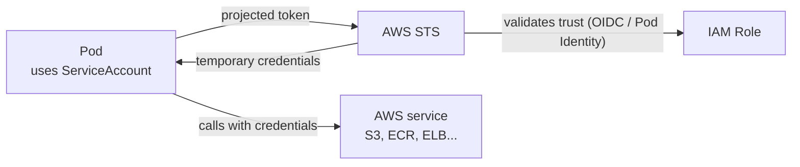

---

## 13. Argo CD (GitOps)

Argo CD continuously compares the manifests stored in Git with what is running in the cluster and syncs the cluster to match Git. If someone changes the cluster by hand, Argo CD detects the drift and can revert it (self-heal). Demo: [06-argocd-application.yaml](app/k8s/06-argocd-application.yaml).

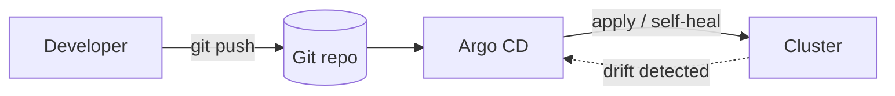

---

## 14. Configuration: ConfigMap and Secret

Keep configuration out of container images so one image works in every environment.

- **ConfigMap** — non-sensitive key/value settings or whole config files.
- **Secret** — the same idea for sensitive data (passwords, tokens, TLS keys). Values are only **base64-encoded, not encrypted**, so enable encryption at rest (on EKS, KMS envelope encryption), restrict access with RBAC, or use an external manager (AWS Secrets Manager with the Secrets Store CSI driver, External Secrets Operator).

Both can be injected into a Pod as **environment variables** or mounted as **files** (mounted files update automatically; environment variables do not until the Pod restarts).

---

## 15. Storage: Volume, PV, PVC, StorageClass

Container filesystems vanish when the container restarts, so persistent data needs volumes.

- **Volume** — a directory made available to a Pod; types include `emptyDir` (scratch space that lives as long as the Pod), `configMap`, `secret` and persistent disks.
- **PersistentVolume (PV)** — a piece of storage in the cluster (for example an AWS EBS volume).
- **PersistentVolumeClaim (PVC)** — a Pod's *request* for storage ("I need 10Gi, ReadWriteOnce"). Pods reference the PVC, never the disk directly.
- **StorageClass** — describes a kind of storage (gp3, io2) and enables **dynamic provisioning**: creating a PVC makes the CSI driver create the disk automatically (on EKS this needs the EBS CSI driver add-on).

Access modes: `ReadWriteOnce` (one node), `ReadOnlyMany`, `ReadWriteMany` (many nodes; EBS does not support it, EFS does).

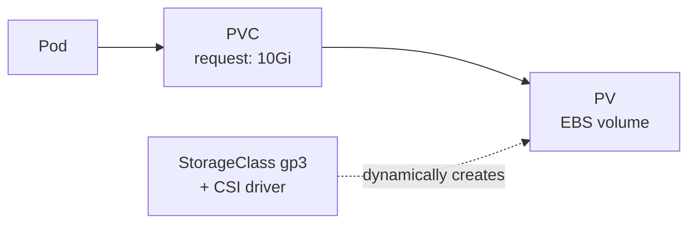

---

## 16. Namespaces, Labels and Annotations

- **Namespace** — a virtual partition of the cluster for teams, environments or apps. Names only need to be unique within a namespace; quotas, RBAC and NetworkPolicies can be applied per namespace. Default ones: `default`, `kube-system`, `kube-public`, `kube-node-lease`.
- **Labels** — key/value tags used for **selecting** objects (Services to Pods, ReplicaSets to Pods, affinity rules).
- **Annotations** — key/value metadata for tools and humans that is **not** used for selection (for example the Argo CD Image Updater and ALB settings in this project).

---

## 17. Security Basics

### RBAC (Role-Based Access Control)

Controls **who can do what** against the API server.

- **Role / ClusterRole** — a set of permissions (verbs such as `get`, `list`, `create` on resources such as `pods`). A Role is namespaced; a ClusterRole is cluster-wide.
- **RoleBinding / ClusterRoleBinding** — attaches a Role to a user, group or ServiceAccount.

Principle of least privilege: grant only what is needed. On EKS, AWS IAM identities are mapped to Kubernetes users/groups (access entries), then RBAC decides what they can do.

### NetworkPolicy

By default every Pod can talk to every other Pod. A NetworkPolicy is a firewall rule at the Pod level that allows only specified ingress/egress traffic (for example "only the frontend may reach the database on port 5432"). It needs a CNI that enforces it (Calico, Cilium, or the VPC CNI with network policy enabled).

### Pod security basics

Run as a non-root user, use a read-only root filesystem, drop Linux capabilities, never run `privileged` containers unless required, and enforce this cluster-wide with **Pod Security Admission** (levels: privileged, baseline, restricted).

---

## 18. Networking Model in One Page

Kubernetes requires that: every Pod gets its own IP; Pods can reach all other Pods without NAT; and nodes can reach all Pods. On EKS the VPC CNI gives Pods real VPC IP addresses (this is why the Pod-per-node limit depends on instance ENIs). Services give those moving Pods a stable address, CoreDNS gives the Service a name, and Ingress/Gateway bring traffic in from outside.

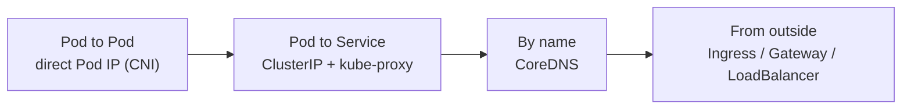

---

## 19. Extending Kubernetes and Packaging

- **CustomResourceDefinition (CRD)** — adds your own object types to the API (for example Argo CD's `Application`). An **Operator** is a controller that manages such a custom resource, automating operational knowledge (for example a database operator).
- **Helm** — package manager; bundles manifests as a *chart* with templated values.
- **Kustomize** — built into `kubectl`; customises plain YAML per environment with overlays and patches, no templates.

---

## 20. Essential kubectl Commands

```bash
kubectl get pods -A -o wide              # list Pods in all namespaces with node and IP
kubectl describe pod <pod>               # events and details: first stop when debugging
kubectl logs <pod> -f [-c container]     # stream logs (add --previous after a crash)
kubectl exec -it <pod> -- sh             # shell into a container
kubectl apply -f file.yaml               # create or update declaratively
kubectl delete -f file.yaml              # remove what a file created
kubectl scale deploy/<name> --replicas=5
kubectl rollout status|history|undo deploy/<name>
kubectl port-forward svc/<name> 8080:80 # reach a Service from your laptop
kubectl get events --sort-by=.lastTimestamp
kubectl top nodes|pods                   # needs metrics-server
kubectl explain deployment.spec.strategy # built-in field documentation
kubectl drain <node> --ignore-daemonsets # evict Pods before maintenance
```

### Common Pod states and what they usually mean

- **Pending** — not scheduled yet: no node has enough resources, a taint blocks it, or a PVC is unbound.
- **ImagePullBackOff / ErrImagePull** — wrong image name/tag or missing registry permissions.
- **CrashLoopBackOff** — the container keeps crashing; check `kubectl logs --previous`.
- **OOMKilled** — exceeded its memory limit.
- **Running but not Ready** — readiness probe is failing, so it receives no Service traffic.

---

## 21. Suggested Learning Path

1. Containers and Docker basics (images, layers, registries).
2. Pod, ReplicaSet, Deployment, Service — run them hands-on with this demo.
3. ConfigMap, Secret, volumes, namespaces, probes, requests and limits.
4. Ingress / Gateway API, RBAC, NetworkPolicy, scheduling (affinity, taints).
5. Autoscaling (HPA, Cluster Autoscaler/Karpenter), PDB, StatefulSet.
6. Helm/Kustomize, GitOps (Argo CD), observability (Prometheus, Grafana).
7. Certification: **CKAD** (developer), **CKA** (administrator), **CKS** (security) — hands-on, terminal-based exams where the official docs are allowed, so learn to navigate them.

---

## 22. Official References

- Kubernetes documentation home: https://kubernetes.io/docs/home/
- Concepts overview: https://kubernetes.io/docs/concepts/
- Cluster architecture (components): https://kubernetes.io/docs/concepts/architecture/
- Pods: https://kubernetes.io/docs/concepts/workloads/pods/
- Deployments (strategies, maxSurge): https://kubernetes.io/docs/concepts/workloads/controllers/deployment/
- DaemonSet: https://kubernetes.io/docs/concepts/workloads/controllers/daemonset/
- StatefulSet: https://kubernetes.io/docs/concepts/workloads/controllers/statefulset/
- Services: https://kubernetes.io/docs/concepts/services-networking/service/
- Ingress: https://kubernetes.io/docs/concepts/services-networking/ingress/
- Gateway API: https://kubernetes.io/docs/concepts/services-networking/gateway/
- DNS for Services and Pods (CoreDNS): https://kubernetes.io/docs/concepts/services-networking/dns-pod-service/
- Assigning Pods to nodes (selector, affinity): https://kubernetes.io/docs/concepts/scheduling-eviction/assign-pod-node/
- Taints and tolerations: https://kubernetes.io/docs/concepts/scheduling-eviction/taint-and-toleration/
- Pod QoS classes: https://kubernetes.io/docs/concepts/workloads/pods/pod-qos/
- Disruptions and PodDisruptionBudget: https://kubernetes.io/docs/concepts/workloads/pods/disruptions/
- Probes: https://kubernetes.io/docs/tasks/configure-pod-container/configure-liveness-readiness-startup-probes/
- Horizontal Pod Autoscaling: https://kubernetes.io/docs/tasks/run-application/horizontal-pod-autoscale/
- ConfigMaps and Secrets: https://kubernetes.io/docs/concepts/configuration/
- Persistent Volumes: https://kubernetes.io/docs/concepts/storage/persistent-volumes/
- Service Accounts: https://kubernetes.io/docs/concepts/security/service-accounts/
- RBAC: https://kubernetes.io/docs/reference/access-authn-authz/rbac/
- Network Policies: https://kubernetes.io/docs/concepts/services-networking/network-policies/
- kubectl cheat sheet: https://kubernetes.io/docs/reference/kubectl/quick-reference/
- Interactive tutorials: https://kubernetes.io/docs/tutorials/
- AWS EKS: https://docs.aws.amazon.com/eks/latest/userguide/
- EKS Pod Identity: https://docs.aws.amazon.com/eks/latest/userguide/pod-identities.html
- Argo CD: https://argo-cd.readthedocs.io/

---

## Summary

- Control plane **decides**, worker nodes **run**; everything talks through the API server.
- Deployment → ReplicaSet → Pod: the Deployment handles updates, the ReplicaSet keeps the count, the Pod runs containers.
- Reach Pods through a Service (ClusterIP → NodePort → LoadBalancer), and share one load balancer across apps with Ingress.
- CoreDNS makes Service names resolvable inside the cluster.
- Ingress shares one load balancer across many HTTP apps; Gateway API is its more capable, multi-protocol successor.
- nodeSelector / affinity attract Pods to nodes; taints repel them unless tolerated.
- QoS (Guaranteed, Burstable, BestEffort) decides eviction order under resource pressure.
- DaemonSet = one Pod per node; StatefulSet = stable identity for stateful apps; Job/CronJob = run to completion.
- `maxSurge`/`maxUnavailable` pace rollouts; a PDB protects availability during drains and upgrades; HPA scales Pod count.
- ServiceAccount identifies a Pod to Kubernetes; IRSA / Pod Identity extend it to AWS IAM.
