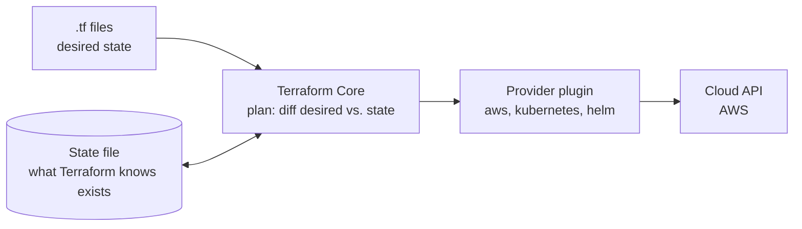
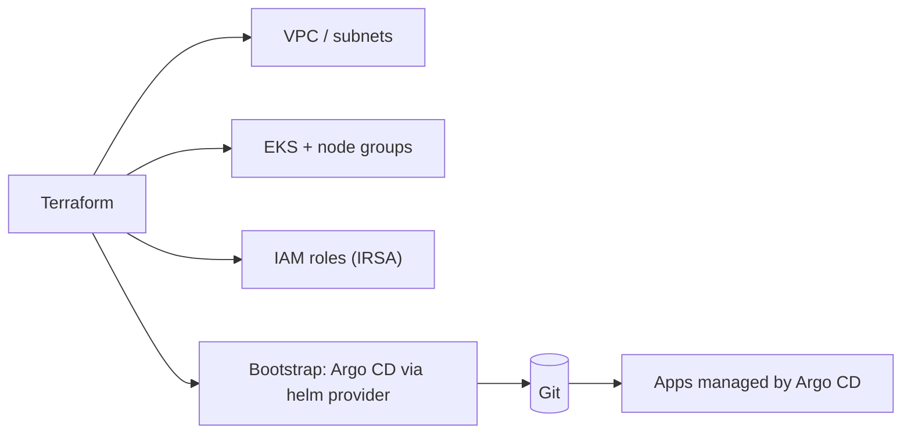

# Terraform Concepts — Reading Guide

A plain-language reference for Terraform, with examples drawn from provisioning AWS EKS.

---

## 1. What Terraform Is

Terraform is an **Infrastructure as Code (IaC)** tool. You describe the infrastructure you want in declarative `.tf` files (HCL language); Terraform compares that with what exists and makes the changes needed. You state the **desired end state**, not the steps.



---

## 2. Core Workflow

```bash
terraform init      # download providers and modules, configure the backend
terraform fmt       # format code
terraform validate  # check syntax and internal consistency
terraform plan      # preview: what will be created / changed / destroyed
terraform apply     # make the changes (asks for confirmation)
terraform destroy   # remove everything in this configuration
```

- `plan -out=tfplan` then `apply tfplan` guarantees that what you reviewed is what runs.
- Plan symbols: `+` create, `-` destroy, `~` update in place, `-/+` replace (destroy then create).

---

## 3. Building Blocks

- **Provider** — plugin that talks to an API (`aws`, `kubernetes`, `helm`, `random`). Pin its version.
- **Resource** — a managed infrastructure object (`aws_vpc`, `aws_eks_cluster`). Terraform creates, updates and deletes it.
- **Data source** — read-only lookup of something that already exists (`data "aws_caller_identity"`, an existing VPC, an AMI).
- **Variable** — an input (`variable "region" {}`), set through `terraform.tfvars`, `-var`, or `TF_VAR_*` environment variables.
- **Output** — a value exported after apply (cluster endpoint, ECR URL) and readable by other configurations or scripts.
- **Local** — a named expression to avoid repetition (`locals { name = "${var.env}-eks" }`).
- **Module** — a reusable folder of Terraform code, called with inputs and returning outputs.

```hcl
terraform {
  required_version = ">= 1.5"
  required_providers {
    aws = { source = "hashicorp/aws", version = "~> 5.0" }
  }
}

variable "region" { default = "ap-south-1" }

resource "aws_ecr_repository" "app" {
  name = "demo-app"
}

output "ecr_url" { value = aws_ecr_repository.app.repository_url }
```

---

## 4. State and the S3 Backend

The **state file** (`terraform.tfstate`) maps each resource in code to the real object in the cloud and stores the last-known attributes. Terraform uses it to compute a plan and to know what already exists.

- State can contain **secrets in plain text** (passwords, keys). Never commit it to Git; add `*.tfstate*` and `.terraform/` to `.gitignore`.
- **Remote backend** — S3 is the standard shared backend for Terraform on AWS. Terraform stores the state object at `bucket/key` and uses the bucket as the single source of truth for the team.
- **State locking** — there are two patterns in practice:
  - **Old / legacy**: DynamoDB table was used to lock the state (`dynamodb_table`), often with a `LockID` key.
  - **New / current**: the S3 backend supports built-in locking using a lock file (`.tflock`) with `use_lockfile = true`; this is the recommended path and the DynamoDB approach is deprecated.
- **Workspace-aware state** — with workspaces, Terraform stores the default workspace at the configured `key`, and non-default workspaces under `<workspace_key_prefix>/<workspace_name>/<key>`. The default prefix is `env:`.
- **Versioning, encryption and IAM** — enable bucket versioning, turn on server-side encryption, and restrict permissions to read/write the state object and the lock file.

```hcl
# Old pattern (legacy / deprecated)
terraform {
  backend "s3" {
    bucket         = "my-tf-state"
    key            = "eks/terraform.tfstate"
    region         = "ap-south-1"
    encrypt        = true
    dynamodb_table = "terraform-locks"
  }
}

# New pattern (recommended)
terraform {
  backend "s3" {
    bucket              = "my-tf-state"
    key                 = "eks/terraform.tfstate"
    region              = "ap-south-1"
    encrypt             = true
    use_lockfile        = true
    workspace_key_prefix = "env:"
  }
}
```

One-liner (old): use a DynamoDB table for state locking with `dynamodb_table`, which was the classic Terraform S3 backend pattern.

One-liner (new): use the S3 backend lock file via `use_lockfile = true`; no separate DynamoDB table is required for locking.

One-liner: for safe state handling, keep the bucket versioned, encrypted, and IAM-scoped to the state object and `.tflock` file.

For a non-default workspace such as `staging`, Terraform writes the state under a path like:

```text
env:/staging/eks/terraform.tfstate
```

The lock file is usually written alongside it as:

```text
env:/staging/eks/terraform.tfstate.tflock
```

### IAM permissions for the S3 backend

The official Terraform docs require S3 permissions on the bucket and state object. At minimum:

- `s3:ListBucket` on the bucket itself
- `s3:GetObject` and `s3:PutObject` on the state object
- if `use_lockfile = true`, `s3:GetObject`, `s3:PutObject` and `s3:DeleteObject` on the `.tflock` file

Example minimal permissions pattern:

```json
{
  "Version": "2012-10-17",
  "Statement": [
    {
      "Effect": "Allow",
      "Action": ["s3:ListBucket"],
      "Resource": "arn:aws:s3:::my-tf-state"
    },
    {
      "Effect": "Allow",
      "Action": ["s3:GetObject", "s3:PutObject"],
      "Resource": "arn:aws:s3:::my-tf-state/eks/terraform.tfstate"
    },
    {
      "Effect": "Allow",
      "Action": ["s3:GetObject", "s3:PutObject", "s3:DeleteObject"],
      "Resource": "arn:aws:s3:::my-tf-state/eks/terraform.tfstate.tflock"
    }
  ]
}
```

For workspaces, grant the same access pattern for the workspace prefix, not just the default path.

### Credentials and role assumptions

The Terraform S3 backend supports the normal AWS credential chain:

- environment variables (`AWS_ACCESS_KEY_ID`, `AWS_SECRET_ACCESS_KEY`, `AWS_SESSION_TOKEN`)
- shared config/credentials files (`~/.aws/config`, `~/.aws/credentials`)
- instance profile / ECS task role / IAM role
- `assume_role` and `assume_role_with_web_identity` blocks for cross-account or CI usage

HashiCorp recommends using environment variables or the AWS shared config files instead of hardcoding credentials directly in the backend block. Hardcoded credentials can be written to the `.terraform/` directory and to plan files.

```hcl
terraform {
  backend "s3" {
    bucket = "my-tf-state"
    key    = "eks/terraform.tfstate"
    region = "ap-south-1"

    assume_role = {
      role_arn = "arn:aws:iam::123456789012:role/TerraformAdmin"
      session_name = "terraform-state"
    }
  }
}
```

### State recovery and a safe bucket

The S3 backend is a good place to store Terraform state, but it is not magic protection. To reduce risk:

- enable **bucket versioning** so an accidental overwrite can be restored
- enable **server-side encryption**; optionally use a KMS key
- restrict bucket public access
- use **least-privilege IAM** and separate state buckets for prod and non-prod
- keep state in a separate admin account or account role model for multi-account AWS layouts

Useful state commands:

```bash
terraform state list                        # what is tracked
terraform state show aws_vpc.main
terraform state mv  old.addr new.addr       # rename/move without recreating
terraform state rm  aws_x.y                 # stop managing (does not destroy it)
terraform import aws_s3_bucket.b my-bucket  # bring an existing object under Terraform
terraform force-unlock <LOCK_ID>            # only if a crashed run left a stale lock
```

---

## 5. Dependencies and Meta-Arguments

Terraform builds a **dependency graph** automatically from references: using `aws_vpc.main.id` inside a subnet means the VPC is created first. Independent resources are created in parallel.

- `depends_on` — explicit dependency when no reference exists.
- `count` — create N copies (`count = 3`); addressed by index.
- `for_each` — create one per map key / set item; addressed by key. **Prefer `for_each`**: removing an item from the middle of a `count` list shifts indexes and recreates resources.
- `provider` — choose an aliased provider (for example another region).
- `lifecycle` — control behaviour:
  - `create_before_destroy = true` — build the replacement first (avoids downtime).
  - `prevent_destroy = true` — error instead of deleting (guard a database).
  - `ignore_changes = [tags]` — ignore drift on selected attributes.

```hcl
resource "aws_subnet" "private" {
  for_each          = toset(["a", "b", "c"])
  vpc_id            = aws_vpc.main.id
  availability_zone = "ap-south-1${each.key}"
  cidr_block        = cidrsubnet(aws_vpc.main.cidr_block, 8, index(["a","b","c"], each.key))
}
```

---

## 6. Modules

A module packages related resources for reuse. The folder you run Terraform in is the **root module**; modules it calls are **child modules**.

```hcl
module "eks" {
  source  = "terraform-aws-modules/eks/aws"
  version = "~> 20.0"

  cluster_name    = "demo"
  cluster_version = "1.30"
  vpc_id          = module.vpc.vpc_id
  subnet_ids      = module.vpc.private_subnets
}
```

Good practice: pin versions, expose only the variables callers need, and return useful outputs. Sources can be the public registry, Git or a local path.

---

## 7. Expressions Worth Knowing

- **Conditionals** — `var.env == "prod" ? 3 : 1`.
- **`for` expressions** — `[for s in var.names : upper(s)]`.
- **Dynamic blocks** — generate repeated nested blocks from a list.
- **Functions** — `merge`, `lookup`, `join`, `format`, `cidrsubnet`, `file`, `jsonencode`, `templatefile`.
- **Sensitive values** — `sensitive = true` on variables/outputs hides them in CLI output (they are still in state).

---

## 8. Workspaces, Environments and Layout

- **Workspaces** give multiple state files from one configuration (`terraform workspace new dev`). Useful for simple cases.
- For real environments, most teams prefer **separate directories or separate state keys** per environment (`envs/dev`, `envs/prod`) calling shared modules, so a mistake in dev cannot touch prod.
- Split large stacks into layers (network, cluster, apps) with separate state to reduce blast radius and plan time. Share values through outputs and `terraform_remote_state` or data sources.

---

## 9. Drift, Taint and Replacement

- **Drift** — real infrastructure changed outside Terraform. `terraform plan` shows it; `apply` reverts it. `terraform apply -refresh-only` updates state to match reality without changing infrastructure.
- **Force recreation** — `terraform apply -replace="aws_instance.web"` (the modern replacement for `taint`).
- **Moved blocks** — rename resources in code without destroying them:

```hcl
moved {
  from = aws_instance.web
  to   = aws_instance.app
}
```

---

## 10. Terraform with Kubernetes

Terraform and Kubernetes work at different layers:

- **Terraform** — build the platform: VPC, EKS cluster, node groups, IAM roles (IRSA / Pod Identity), ECR, add-ons.
- **Kubernetes tooling (Helm, Argo CD)** — deploy and operate the applications on top.

Terraform *can* also manage in-cluster objects through the `kubernetes` and `helm` providers, typically only to **bootstrap** the cluster (install Argo CD, the load balancer controller), after which GitOps takes over. Avoid having Terraform and Argo CD manage the same object, because they will fight over it.



---

## 11. Best Practices

- Remote, encrypted, locked, versioned state; never commit state or `.tfvars` with secrets.
- Pin Terraform, provider and module versions; commit `.terraform.lock.hcl`.
- Always review `plan` output; run plan in CI on pull requests and apply only after approval.
- Keep secrets out of code: use AWS Secrets Manager / SSM / environment variables.
- Use small modules and small state files; use `for_each` over `count`.
- Tag every resource consistently (`default_tags` in the AWS provider).
- Use least-privilege IAM for the identity Terraform runs as; prefer OIDC federation in CI over long-lived access keys.
- Scan code with tools such as `tflint`, `checkov` or `trivy` in CI.

---

## 12. Interview Questions and Answers

**Q1. What is the difference between `terraform plan` and `apply`?**
`plan` computes and shows the diff between code, state and reality without changing anything. `apply` executes those changes.

**Q2. Why is state important and how do you protect it?**
It maps code to real resources and records attributes. Protect it with a remote backend (S3), encryption, versioning, locking and restricted access, because it may contain secrets.

**Q3. `count` vs `for_each`?**
`count` indexes resources by position; deleting a middle item renumbers and recreates the rest. `for_each` keys resources by a stable string, so changes are isolated.

**Q4. How do you bring existing infrastructure under Terraform?**
Write the resource block, then `terraform import <address> <id>` (or an `import` block in recent versions), and run `plan` until it shows no diff.

**Q5. Someone changed a resource in the console. What happens?**
That is drift. The next `plan` shows the difference and `apply` reverts it to the code, unless `ignore_changes` covers that attribute.

**Q6. How do you avoid downtime when a resource must be replaced?**
`lifecycle { create_before_destroy = true }`, which builds the new resource before removing the old one (subject to name/uniqueness conflicts).

**Q7. How do you manage multiple environments?**
Separate state per environment (directories or backend keys) using shared modules with different variable values; workspaces for lightweight cases. Isolate prod credentials and state.

**Q8. How do you handle secrets?**
Do not hard-code them. Reference secret managers via data sources, use `sensitive`, and remember they still land in state, so secure the backend.

**Q9. What happens if two people run `apply` at the same time?**
State locking makes the second run fail until the first finishes. Use `force-unlock` only when you are sure a lock is stale.

**Q10. Terraform vs CloudFormation vs Pulumi?**
Terraform is multi-cloud with a large provider ecosystem and its own language (HCL); CloudFormation is AWS-only and managed by AWS; Pulumi uses general-purpose languages. They all use a declarative desired-state model.

**Q11. How would you roll out an EKS version upgrade with Terraform?**
Raise `cluster_version` (one minor version at a time), apply to upgrade the control plane, then update managed node groups (rolling replacement honouring PodDisruptionBudgets) and add-on versions. Test in a lower environment first.

**Q12. What are `terraform_remote_state` and data sources used for?**
To read outputs or existing objects from another configuration or the cloud, so layers (network, cluster, apps) can stay in separate states.

---

## 13. Official References

- Terraform documentation: https://developer.hashicorp.com/terraform/docs
- Language reference (HCL): https://developer.hashicorp.com/terraform/language
- CLI commands: https://developer.hashicorp.com/terraform/cli
- State and backends: https://developer.hashicorp.com/terraform/language/state
- S3 backend: https://developer.hashicorp.com/terraform/language/backend/s3
- Official note: HashiCorp docs describe both patterns: the older DynamoDB table pattern (`dynamodb_table`) and the newer S3 lockfile pattern (`use_lockfile = true`), with DynamoDB locking marked deprecated.
- Modules: https://developer.hashicorp.com/terraform/language/modules
- AWS provider: https://registry.terraform.io/providers/hashicorp/aws/latest/docs
- EKS module: https://registry.terraform.io/modules/terraform-aws-modules/eks/aws/latest
- Tutorials: https://developer.hashicorp.com/terraform/tutorials
