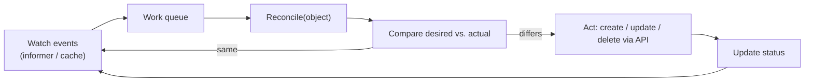
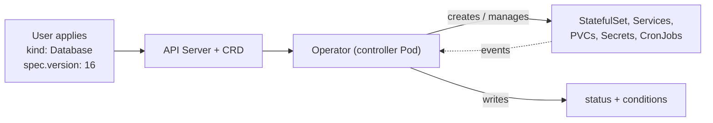
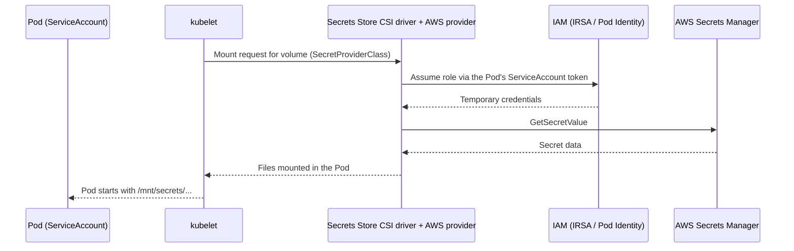
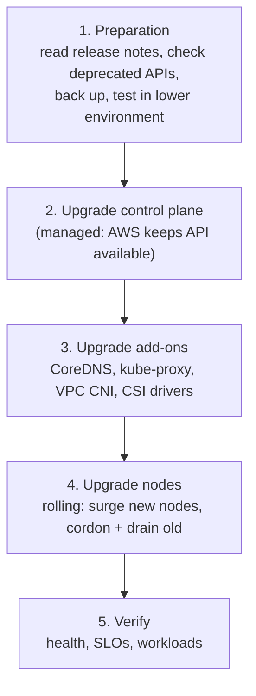

# Advanced Kubernetes — Concepts and Interview Q&A

Controllers, operators, secrets with CSI drivers, zero-downtime upgrades, availability and resiliency. Read [kubernetes.md](kubernetes.md) first for the fundamentals.

---

## 1. Controllers and the Reconciliation Loop

**Q: What is a controller?**
A control loop that watches objects through the API server, compares **desired state** (the `spec`) with **observed state** (the `status` and the real world), and takes action to close the gap. It repeats forever. Deployment, ReplicaSet, Node, Job and Service controllers are all examples, and they run inside `kube-controller-manager`.



Key properties:

- **Level-triggered, not edge-triggered** — a controller reconciles to the *current* state, so if it misses an event or restarts it still converges.
- **Idempotent** — running reconcile twice gives the same result.
- **Declarative** — you say *what*, the controller works out *how*.
- **Eventually consistent** — convergence takes time; use `status` and conditions to see progress.

**Q: How do controllers avoid hammering the API server?**
Shared informers keep a local cache fed by a single watch; reconcile reads from the cache and a rate-limited work queue retries failures with back-off.

**Q: What are owner references and finalizers?**
- **OwnerReference** links a child to its parent (Pod to ReplicaSet to Deployment); deleting the parent lets the garbage collector delete children.
- **Finalizers** are keys on an object that block its deletion until a controller finishes cleanup (for example releasing an external load balancer or disk), then removes the finalizer. An object stuck in `Terminating` often has a finalizer whose controller is gone.

**Q: What are leader election and why are they used?**
Controllers are run with several replicas for availability, but only one should act at a time. A `Lease` object is used so one replica is the active leader and others stand by to take over.

---

## 2. Operators

**Q: What is an Operator?**
An operator is a **custom controller plus a CustomResourceDefinition (CRD)** that encodes human operational knowledge for an application: install, configure, back up, upgrade, fail over. You declare, for example, a `Postgres` object with `replicas: 3`, and the operator creates StatefulSets, Services, Secrets and backup jobs, and keeps them healthy.



**Q: Controller vs Operator?**
All operators are controllers. "Operator" usually means a controller for a **custom resource** that manages a **complex, often stateful** application with domain logic (replication, backups, upgrades), while built-in controllers manage core resources.

**Q: What is a CRD and a custom resource?**
A CRD registers a new API type (`kind`, `group`, version, an OpenAPI schema for validation). A custom resource is an instance of it. Once registered, `kubectl` and RBAC treat it like any built-in resource.

**Q: How are operators built?**
With Kubebuilder or the Operator SDK (Go), or Helm- or Ansible-based operators for simpler cases. Libraries like controller-runtime provide informers, caches, work queues and leader election.

### Operator lifecycle management

Two separate meanings:

1. **Lifecycle the operator performs for the application** (day-1 and day-2 operations):
   - **Install/provision** — create all required objects from one custom resource.
   - **Configure and reconfigure** — react to spec changes.
   - **Scale and heal** — add replicas, replace failed members, re-elect primaries.
   - **Backup and restore.**
   - **Upgrade** — orchestrate version upgrades in a safe order (replicas first, then the primary), with pre-checks.
   - **Delete** — use finalizers to take a final backup or release external resources.
   - **Report** — expose `status.conditions` (Ready, Degraded, Progressing).

2. **Lifecycle of the operator itself** (managed by **Operator Lifecycle Manager, OLM**):
   - OLM installs operators from catalogs, resolves dependencies, handles **upgrades with versioned ClusterServiceVersions (CSV)** and channels, and manages permissions (RBAC) the operator needs.
   - Without OLM, operators are commonly installed with Helm and upgraded through GitOps.
   - **CRD upgrades** need care: Helm does not upgrade CRDs in a chart's `crds/` folder, and CRD schema changes must remain compatible with stored objects (use API versioning and conversion webhooks).

**Q: Operator maturity levels?**
Basic install, seamless upgrades, full lifecycle (backup/restore), deep insights (metrics, alerts), auto-pilot (auto-scaling, tuning, self-healing).

**Q: Common operators?**
Prometheus Operator, cert-manager, Strimzi (Kafka), CloudNativePG/Zalando (PostgreSQL), Argo CD itself, External Secrets Operator.

**Q: What can go wrong with operators?**
A bug in the operator can break many workloads at once; unmanaged CRD upgrades; operator Pod down means no reconciliation (running workloads usually keep running, but healing stops); overly broad RBAC. Run the operator with multiple replicas and leader election and test upgrades first.

---

## 3. Secrets with the Secrets Store CSI Driver

**Q: Why not just use Kubernetes Secrets?**
They are only base64-encoded, are stored in etcd, are visible to anyone with read access in the namespace, and tend to leak into Git. Central managers (AWS Secrets Manager, SSM Parameter Store, HashiCorp Vault) provide proper encryption, rotation, auditing and fine-grained IAM.

**Q: How does the Secrets Store CSI Driver work?**
A DaemonSet CSI driver plus a **provider** (AWS provider) mounts secrets from an external manager into the Pod as a **volume**; the secret never has to be stored in Git. It authenticates as the Pod's ServiceAccount through **IRSA or EKS Pod Identity**, so access is controlled by IAM roles per workload.



Configuration is defined in a `SecretProviderClass`:

```yaml
apiVersion: secrets-store.csi.x-k8s.io/v1
kind: SecretProviderClass
metadata:
  name: db-creds
spec:
  provider: aws
  parameters:
    objects: |
      - objectName: "prod/db-password"
        objectType: "secretsmanager"
---
# in the Pod spec
volumes:
  - name: secrets
    csi:
      driver: secrets-store.csi.k8s.io
      readOnly: true
      volumeAttributes:
        secretProviderClass: db-creds
```

Important points:

- The Pod **cannot start until the mount succeeds**, which makes a missing secret or permission visible immediately.
- Optionally **sync as a Kubernetes Secret** (`secretObjects`) so apps can use environment variables; the synced Secret exists only while a Pod mounts it.
- **Rotation** — enable the rotation reconciler to refresh mounted files periodically. Environment variables do not update without a Pod restart; apps should re-read the file or you can restart with a tool such as Reloader.

**Q: CSI driver vs External Secrets Operator?**
- **CSI driver** — secrets are mounted as files at Pod start; no Secret object is required; tied to the Pod lifecycle.
- **External Secrets Operator** — an operator that periodically copies external secrets into native Kubernetes Secrets (works naturally with env vars, Ingress TLS and anything that needs a Secret object), but the value lives in etcd, so encrypt etcd.

**Q: Other layers of protection for Kubernetes Secrets?**
Enable envelope encryption of etcd with KMS, restrict RBAC (`get/list` on Secrets is powerful), per-namespace boundaries, audit logs, Sealed Secrets or SOPS for GitOps, and short-lived credentials via IRSA/Pod Identity instead of static keys.

---

## 4. Upgrading a Cluster Without Downtime

**Q: How do you upgrade an EKS/Kubernetes cluster with no downtime?**

Order matters: **control plane first, then nodes, then add-ons.** Upgrade **one minor version at a time**; node (kubelet) versions may lag the control plane only within the supported skew.



**Preparation checklist**
- Read the release notes and find **removed/deprecated APIs** (for example with `kubent` or `pluto`) and fix manifests and Helm charts first.
- Check that add-ons, operators, ingress controllers and CRDs support the target version.
- Ensure every critical workload has **multiple replicas, readiness probes and a PodDisruptionBudget**.
- Make sure topology spread / anti-affinity places replicas across nodes and zones.
- Back up state (etcd is managed on EKS; back up persistent volumes with snapshots, and keep manifests in Git).
- Rehearse in a non-production cluster.

**Control plane:** on EKS, AWS updates the API servers behind the scenes with a rolling process, so the API stays available. Self-managed clusters upgrade one control plane node at a time (`kubeadm upgrade`) in a multi-master setup.

**Worker nodes: two safe strategies**

1. **In-place rolling (managed node groups):** new nodes are launched with the new version (surge), old nodes are **cordoned** (no new Pods) and **drained** (Pods evicted gracefully, honouring PDBs and `terminationGracePeriodSeconds`), then terminated.
2. **Blue/green node groups:** create a new node group on the new version, cordon and drain the old group, delete it. Easy to roll back by keeping the old group until confident.

```bash
kubectl cordon <node>                                   # stop scheduling new Pods
kubectl drain <node> --ignore-daemonsets --delete-emptydir-data   # evict gracefully
# ... replace/upgrade the node ...
kubectl uncordon <node>
```

**What makes this safe (and what breaks it)**
- **PDB** limits how many replicas can be evicted at once; without it a drain can remove all replicas of one app together. A PDB with `minAvailable` equal to `replicas` blocks drains entirely.
- **Readiness probes** make sure traffic only goes to Pods that are ready.
- **Graceful shutdown**: handle `SIGTERM`, use a `preStop` hook / short sleep so load balancers deregister before the Pod stops, and set a sufficient `terminationGracePeriodSeconds`.
- **Single-replica workloads** will have downtime during a drain; run at least 2 replicas.
- **StatefulSets and local storage:** EBS volumes are zone-bound, so a Pod must be rescheduled in the same availability zone; keep spare capacity in every zone.
- **Capacity:** surge nodes provide room for evicted Pods; the Cluster Autoscaler or Karpenter must be able to scale.
- **DaemonSets** are ignored by drain (`--ignore-daemonsets`); upgrade them with their own rolling strategy.

**Q: How do you do a zero-downtime *application* upgrade?**
Rolling update with `maxUnavailable: 0` and a suitable `maxSurge`, readiness probes, `minReadySeconds`, graceful shutdown, and backward-compatible database changes (expand then contract). For higher safety use canary or blue/green with Argo Rollouts or a service mesh, with automatic rollback on failing metrics.

**Q: Version skew rules?**
`kubelet` may be up to a few minor versions older than the API server (never newer); `kubectl` may differ by one minor version. Check the official version-skew policy for the exact numbers for your release.

---

## 5. Availability and Resiliency

**Q: How do you design a highly available application on Kubernetes?**
Layer protections at every level:

| Layer | Technique |
|---|---|
| Application | Multiple replicas, stateless design, graceful shutdown, retries with back-off and timeouts, circuit breakers |
| Pod | Readiness, liveness and startup probes; sensible requests/limits (QoS) |
| Scheduling | Pod anti-affinity or **topology spread constraints** across nodes and zones |
| Disruption | **PodDisruptionBudgets**, controlled rolling updates |
| Capacity | HPA for Pods, Cluster Autoscaler/Karpenter for nodes, headroom for failures |
| Cluster | Multi-AZ node groups, managed multi-AZ control plane |
| Data | Replicated databases/StatefulSets with operators, PV snapshots, tested backups |
| Delivery | GitOps, progressive delivery, fast rollback |
| Region | Multi-region active-passive or active-active for disaster recovery |

**Topology spread constraints** (spread replicas evenly):

```yaml
topologySpreadConstraints:
  - maxSkew: 1
    topologyKey: topology.kubernetes.io/zone
    whenUnsatisfiable: DoNotSchedule
    labelSelector:
      matchLabels: { app: web }
```

**Q: A node dies. What happens to its Pods?**
The node controller marks the node `NotReady` after the grace period, adds `NoExecute` taints (`not-ready` / `unreachable`), and after the toleration period (default 300 s) Pods are evicted and recreated by their ReplicaSets on healthy nodes. You can shorten `tolerationSeconds` on Pods for faster failover. StatefulSet Pods wait for stronger guarantees that the old Pod is really gone before replacement.

**Q: A Pod crashes repeatedly (CrashLoopBackOff). How do you troubleshoot?**
`kubectl describe pod` for events and last state; `kubectl logs --previous` for the crashed container; check exit code (137 = SIGKILL/OOM, 1 = application error), memory limits, failing liveness probes, missing config/secrets, and image/command errors.

**Q: Availability vs resiliency?**
Availability is the proportion of time the service is usable. Resiliency is the ability to withstand and recover from failures (node, zone, dependency, bad deploy) automatically. Resilient design is what produces high availability.

**Q: What are RTO and RPO?**
RTO (Recovery Time Objective) — how long you can be down. RPO (Recovery Point Objective) — how much data loss is acceptable. They drive the choice of backup frequency, replication and multi-region design.

**Q: How do you prevent cascading failures?**
Timeouts and bounded retries with jitter, circuit breakers, rate limiting, resource limits so one workload cannot starve others (ResourceQuota/LimitRange), bulkheads via namespaces and node pools, and load shedding.

**Q: How do you test resiliency?**
Chaos engineering (Chaos Mesh, Litmus, AWS Fault Injection Service): kill Pods, drain nodes, inject latency, simulate an AZ outage, then verify SLOs. Regularly restore backups to prove they work.

**Q: Why might a Deployment have free replicas but still lose traffic during a rollout?**
Missing readiness probe (traffic sent to starting Pods), no graceful shutdown (in-flight requests dropped when a Pod is killed), or load balancer deregistration delay longer than the Pod's termination. Fix with probes, `preStop` sleep, and tuned grace periods and deregistration delay.

---

## 6. More Advanced Questions and Answers

**Q: How does a Service route traffic and what does kube-proxy do?**
The **EndpointSlice** controller tracks ready Pod IPs for a Service. kube-proxy on each node watches Services and EndpointSlices and programs **iptables or IPVS** rules (or eBPF with some CNIs such as Cilium) that DNAT the ClusterIP to a chosen Pod IP. Only Ready Pods are included.

**Q: What happens when you run `kubectl apply -f deployment.yaml`?**
kubectl sends it to the API server, which authenticates, authorizes (RBAC), runs admission controllers (mutating, then validating) and stores it in etcd. The Deployment controller creates a ReplicaSet, the ReplicaSet controller creates Pods, the scheduler assigns nodes, and each kubelet starts containers through the container runtime and reports status back.

**Q: What are admission controllers and webhooks?**
Plugins that intercept API requests after authorization and before persistence. **Mutating** ones can modify objects (inject sidecars, defaults); **validating** ones accept or reject (policy enforcement such as Kyverno or OPA Gatekeeper). A failing webhook with `failurePolicy: Fail` can block the whole cluster, so scope them carefully.

**Q: Requests vs limits, and what about CPU throttling?**
Requests are what the scheduler reserves; limits are the cap. Exceeding the memory limit gets the container OOM-killed; exceeding the CPU limit throttles it. Many teams set CPU requests without CPU limits to avoid unnecessary throttling, but always set memory requests and limits.

**Q: HPA vs VPA vs Cluster Autoscaler vs Karpenter?**
HPA changes Pod count; VPA changes Pod resource requests; Cluster Autoscaler adds/removes nodes in predefined node groups; Karpenter provisions right-sized nodes directly based on pending Pods. HPA and VPA should not both act on the same CPU/memory metric.

**Q: How do you secure a cluster?**
Least-privilege RBAC, IRSA/Pod Identity instead of node-wide credentials, private API endpoint or restricted CIDRs, NetworkPolicies, Pod Security Admission (restricted), image scanning and signing, non-root read-only containers, secret encryption with KMS, audit logging, and admission policies.

**Q: How do you debug a Pod that is Pending?**
`kubectl describe pod` and read the Events: insufficient CPU/memory, untolerated taints, unmatched node selectors/affinity, unbound PVC, or ENI/IP limits (on EKS with the VPC CNI the maximum Pods per node depends on instance type).

**Q: What is etcd and how is it protected?**
The consistent key-value store (Raft consensus) holding all cluster state. Run an odd number of members (3 or 5), back it up with snapshots, encrypt at rest, restrict network access, and keep it on fast disks. On EKS it is managed by AWS.

**Q: What is a service mesh and when do you need one?**
A dedicated layer (Istio, Linkerd, Cilium) that provides mTLS, retries, traffic splitting, observability and policy between services through sidecars or an ambient/eBPF data plane. Use it when you need consistent security and traffic control across many services; avoid it for small systems because of added complexity.

**Q: Blue/green vs canary vs rolling?**
Rolling replaces Pods gradually in place; blue/green runs a full second environment and switches traffic at once (instant rollback, double capacity); canary sends a small percentage of traffic to the new version and increases it as metrics stay healthy.

---

## Official References

- Controllers: https://kubernetes.io/docs/concepts/architecture/controller/
- Operator pattern: https://kubernetes.io/docs/concepts/extend-kubernetes/operator/
- Custom Resources / CRDs: https://kubernetes.io/docs/concepts/extend-kubernetes/api-extension/custom-resources/
- Finalizers: https://kubernetes.io/docs/concepts/overview/working-with-objects/finalizers/
- Operator SDK: https://sdk.operatorframework.io/
- Kubebuilder book: https://book.kubebuilder.io/
- Operator Lifecycle Manager: https://olm.operatorframework.io/
- Secrets Store CSI Driver: https://secrets-store-csi-driver.sigs.k8s.io/
- AWS Secrets Manager CSI provider: https://docs.aws.amazon.com/secretsmanager/latest/userguide/integrating_csi_driver.html
- External Secrets Operator: https://external-secrets.io/
- Safely draining a node: https://kubernetes.io/docs/tasks/administer-cluster/safely-drain-node/
- Disruptions and PDB: https://kubernetes.io/docs/concepts/workloads/pods/disruptions/
- Version skew policy: https://kubernetes.io/releases/version-skew-policy/
- Topology spread constraints: https://kubernetes.io/docs/concepts/scheduling-eviction/topology-spread-constraints/
- Upgrading an EKS cluster: https://docs.aws.amazon.com/eks/latest/userguide/update-cluster.html
- EKS best practices guide (reliability, security): https://aws.github.io/aws-eks-best-practices/
